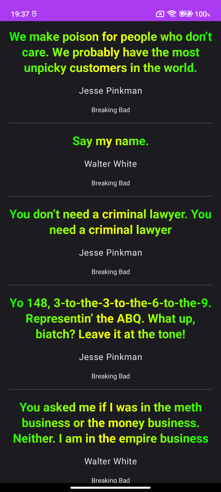

# SayMyName
WORK IN PROGRESS

  <h1 align="center">Say My Name</h1>

   

## Api
Developed by me using kotlin ktor framework. Used mongodb as database.
Published on digital ocean via docker image. If you interested in you can check out with link.
* [SayMyNameApi](https://github.com/emresahin10/ktor-mongodb-saymyname) 

## TODO

- [x] Characters
- [x] Character Detail
- [x] Quotes
- [ ] Character Detail better design
- [ ] Add bottom nav bar
- [ ] Quote Detail
- [ ] Random Quote

## Features
- Listing characters
- Character detail (w8 Better design)
- Listing quotes
- Quote detail (🧑🏽‍💻)
- Random quotes (🧑🏽‍💻)

  ## Architecture
MVVM (Model-View-ViewModel) architecture pattern has been used in the development of this application. The development language of the application is Kotlin.

* Architecture;
    * [ViewModel](https://developer.android.com/topic/libraries/architecture/viewmodel)
    * [Hilt](https://developer.android.com/training/dependency-injection/hilt-android)
    * [Navigation](https://developer.android.com/guide/navigation)

## Tech Stacks
This project uses many of the popular libraries, plugins and tools of the android ecosystem.

- [Compose](https://developer.android.com/jetpack/compose)

    - [Material](https://developer.android.com/jetpack/androidx/releases/compose-material) - Build Jetpack Compose UIs with ready to use Material Design Components.
    - [UI](https://developer.android.com/jetpack/androidx/releases/compose-ui) - Fundamental components of compose UI needed to interact with the device, including layout, drawing, and input.
    - [Lifecycle-ViewModel](https://developer.android.com/jetpack/androidx/releases/lifecycle) - Perform actions in response to a change in the lifecycle status of another component, such as activities and fragments.
    - [Coil](https://coil-kt.github.io/coil/compose/) - An image loading library for Android backed by Kotlin Coroutines.

- [Jetpack](https://developer.android.com/jetpack)

    - [AndroidX](https://developer.android.com/jetpack/androidx) - Major improvement to the original Android [Support Library](https://developer.android.com/topic/libraries/support-library/index), which is no longer maintained.
    - [Lifecycle](https://developer.android.com/topic/libraries/architecture/lifecycle) - Perform actions in response to a change in the lifecycle status of another component, such as activities and fragments.
    - [ViewModel](https://developer.android.com/topic/libraries/architecture/viewmodel) - Designed to store and manage UI-related data in a lifecycle conscious way. The ViewModel class allows data to survive configuration changes such as screen rotations.

- [Retrofit](https://square.github.io/retrofit/)
- [OkHttp-Logging-Interceptor](https://github.com/square/okhttp/blob/master/okhttp-logging-interceptor/README.md) - Logs HTTP request and response data.
- [Coroutines](https://github.com/Kotlin/kotlinx.coroutines) - Library Support for coroutines.
- [Flow](https://developer.android.com/kotlin/flow) - Flows are built on top of coroutines and can provide multiple values.
- [Material Design](https://material.io/develop/android/docs/getting-started/) - Build awesome beautiful UIs.
- [Coroutines](https://github.com/Kotlin/kotlinx.coroutines) - Library Support for coroutines,provides runBlocking coroutine builder used in tests.

## Environment Setup
- Android Studio Hedgehog | 2022.3.1 Canary 5
- Android Studio's Gradle JDK version 17 (Azul coretta aarch64)
 
